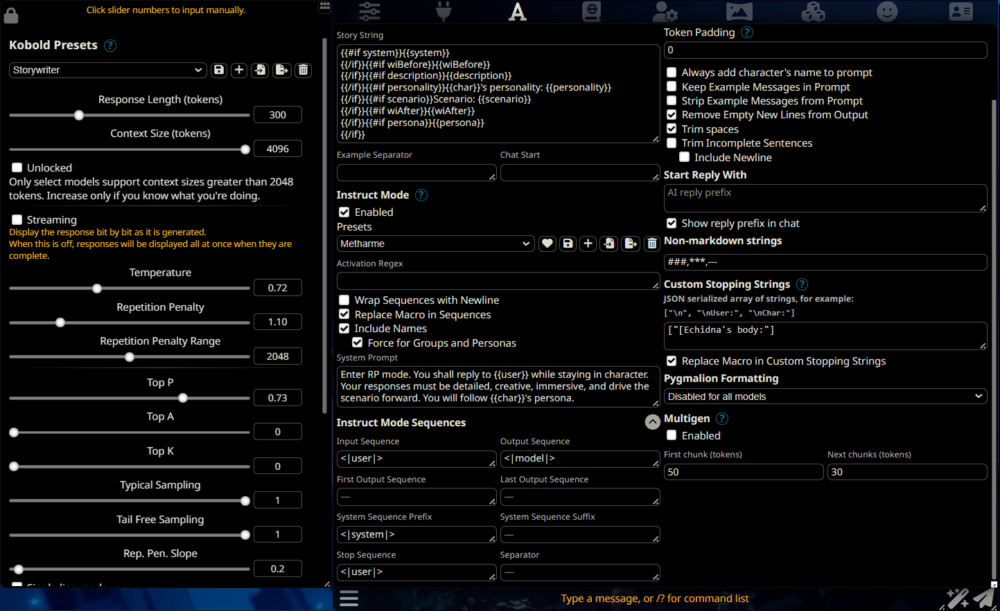
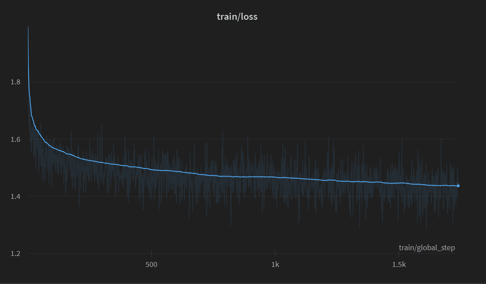
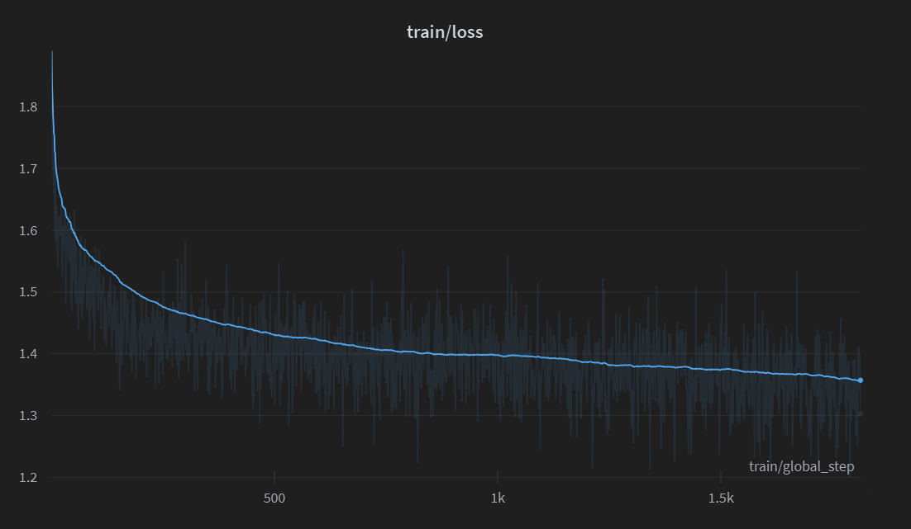

It's been months upon months since a major announcement like this, but we've finally done it: new model releases. Introducing our new models: Pygmalion-2 in **7B**, and **13B** sizes.

## Where We've Been

The burning question on many peoples' minds is likely "where have we been?" Why haven't we released models in so long? What were we up to? I promise, it wasn't slacking. Let's explain from the beginning. A few months ago, a senior dev and great friend named 11b had to take a leave of absence due to personal issues. He was the most capable person we had on the team - and without him, we had to learn a lot by ourselves. Of course, it took a little bit to get up and running, but for the past few months we've been ceaselessly working on both our website and new models, making sure to send the latter through many rounds of human testing.

Alongside that, we've also been building connections and relationships that have helped us grow and gain access to resources needed to train bigger models. This process has paid off; we now have access to H100s, the most coveted GPU in the world at the time of this writing. With them, model training and experimentation can be done much, much faster. In addition, we've recently formed a partnership with the [OpenOrca](https://huggingface.co/Open-Orca) team. You'll be hearing more from the two of us soon!

Since 11b has left, you may be wondering about our current composition. The PygmalionAI's core team members are Alpin and teargosling as lead developers and Tav as project management.

## The New Pygmalion

With that out of the way, let's get straight into the details of how we've trained our newest models, [Pygmalion-2 7B](https://huggingface.co/PygmalionAI/pygmalion-2-7b) and [Pygmalion-2 13B](https://huggingface.co/PygmalionAI/pygmalion-2-13b). We'll go over both the dataset used to train our models and the process of training the models themselves.

### The Dataset

The most important part of fine-tuning any model is the dataset and its composition. One massive problem with our previous Metharme-7B and 13B releases was the fact that not only were many of its responses considered "soulless", but also that it had a tendency to have an undesired alignment carried over from improperly cleaned training data, leading them to be often reluctant or even refusing to roleplay in specific scenarios. Obviously, this had to go. Part of what we've been doing, then, was devising and executing a plan of action to give our models a soul once more. Here's how we did it.

One of the most important realizations is related to the role of GPT-3.5 and GPT-4 in terms of its usefulness to any conversational/roleplay dataset. Many - we'd even dare say most - of the models today use data which was generated from GPT-3.5 and GPT-4. People have noticed, however, that while the OpenAI models are quite intelligent, they're often "lacking something" in terms of creativity. And a fine-tuned model takes after its fine-tuning data: if the data is soulless, the model is soulless. If the data shows moral alignment, the model shows moral alignment. Because of this, we've purged any *purely roleplay* data which uses an OpenAI model to generate it as well as several GPT-generated instructional datasets which were of dubious quality, to say the least. In its place, we've also turned to one more artificial source to help us out: the Claude model, widely reported by many users to have more creativity, expressiveness and *soul* than the OpenAI models.

If soulless data makes a soulless model, then the converse is also true: soulful and creative data makes a soulful and creative model. We've built our new dataset with soul constantly in mind. Alongside other sources, we've used data from high-quality RP forums, stories, and our very own [PIPPA](https://huggingface.co/datasets/PygmalionAI/PIPPA) dataset to build a creative and well-written core for the model to take from. However, creativity isn't always everything. A good model should not just be creative, but also *smart* and able to follow any instructions from the user. This is where dedicated instructional data comes in.

Instructional data for our use case is a double-edged sword. On one hand, high-quality instructional data can cause the model quality to skyrocket if pushed to its absolute limits. On the other hand, if one is not careful, low-quality instructional data can cause the model to not have the ever-desired soul. For this portion of the dataset, we choose the majority of it to comprise of a subset of data from [OpenOrca](https://huggingface.co/datasets/Open-Orca/OpenOrca). While it *is* generated by GPT-4 and 3.5 (though our subset is sourced from only GPT-4 entries), the pure performance boost it gives as a result is outstanding enough to warrant its inclusion in such a high amount. We make sure other instructional datasets contained within ours carry this level of quality - other instructional datasets which show up include [Airoboros](https://huggingface.co/datasets/jondurbin/airoboros-gpt4-1.4.1) and [multi-round instructions from Claude](https://huggingface.co/datasets/Norquinal/claude_multiround_chat_30k) (which ensures that even the instructional part of the dataset at least contains within it a measure of expressiveness.)

We'll divide and go over the sources of our datasets in detail from two sides: the ***creative*** side and the ***instructional*** side.

### Creativity
- **Roleplay forums**
    - Almost a quarter of our dataset contains processed posts from various different roleplay forums which are both SFW and NSFW in nature.

- **Stories**
    - Data scraped from a certain stories website, mostly NSFW.

- [**PIPPA**](https://huggingface.co/datasets/PygmalionAI/PIPPA)
    - User-submitted Character.AI logs. We limit the entries in PIPPA to take only any logs which were submitted before the release of Pygmalion-6B so that our data does not get overwhelmed and to have the same logs that Pygmalion-6B (which is considered by the community to have the most "soul") was trained on.

- [**Club Floyd**](https://wandb.ai/ve-forbryderne/skein/runs/files/files/datasets/floyd)
    - We take some publicly available logs from the transcripts of text-adventure games acted out by members of a website named Club Floyd.

- [**text_adventures.txt**](https://github.com/Latitude-Archives/AIDungeon/blob/ca098ca7dab480d24e47954c8873b03ba1091ffc/data/text_adventures.txt)
    - We also parse the file **text_adventures.txt**, used by Latitude to fine-tune GPT-2 for the purposes of creating the initial version of AI Dungeon.

- [**Claude RP logs**](https://claude.ai)
    - Logs of roleplay acted out with Claude, submitted by our users to [the dumper site](https://dump.nopanda.io/). While it makes up a only tiny percentage of the dataset, we still thank the community for their contributions!

### Instructional
- [**OpenOrca**](https://huggingface.co/datasets/Open-Orca/OpenOrca)
    - Our most populous source of data in the dataset and the absolute majority of the instructional data. OpenOrca consists of millions of examples of FLAN data answered by GPT-3.5 and GPT-4 designed to distill reasoning and step-by-step thought processes to smaller models. We limit the amount of data exposed to the model to 400,000 GPT-4 entries (before pruning any examples higher than context length) to prevent overwhelming the other data sources.

- [**Multiround Claude Instructions**](https://huggingface.co/datasets/Norquinal/claude_multiround_chat_30k)
    - We use multi-turn instructions answered by Claude to provide not only more instructional data, but also to allow for more varied and expressive answers while answering users' questions.

- [**Airoboros**](https://huggingface.co/datasets/jondurbin/airoboros-gpt4-1.4.1)
    - A popular GPT-4 generated instructional dataset containing creative elements and RP within it. We specifically use the 1.4.1 version of Airoboros for our dataset.

- **Guess the Instruction**
    - There is a [paper](https://arxiv.org/abs/2210.02969) which suggests that models' zero-shot capabilities can be improved significantly by doing "flipped learning" - that is, instead of being given an instruction and telling the model to generate an answer, the model is given an *answer* and is tasked to generate an *instruction* instead. We implement something like it and use the [Dolly](https://huggingface.co/datasets/databricks/databricks-dolly-15k) dataset alongside a subset of Airoboros.

### SillyTavern
We have tested the models using [SillyTavern](https://github.com/SillyTavern/SillyTavern). We have found the following settings to work best with our new models. Please try and change your settings to match these for optimal performance:



Credits to Trappu for the settings.

### Training the Models
While the general public has not seen us release any major models for (too many) months, that doesn't mean we haven't been training any new ones. For the past few months, we've been experimenting and gaining experience in fine-tuning new models by sending potential release candidates to a team of testers. Through their help, we've iterated constantly upon feedback to create a model that's ready for release and worth the weight. Let's go into the specifics of our latest models.

We have released fine-tunes of the **Llama-2** base model in two sizes: 7B and 13B. Our 7B model was trained on 8x A40s graciously provided by [Arc Compute](https://www.arccompute.io/) on our full 432M token dataset, while our 13B model was trained on 8x H100s loaned to us by a generous donor.

Though we initially used our own repo for training the models, we later switched to the [axolotl](https://github.com/OpenAccess-AI-Collective/axolotl) codebase for more efficient and streamlined training process.

Our 7B, and 13B models have been trained with the following hyperparameters:
- Micro batch size of 8 on each GPU, resulting in a global batch size of 64.
- Learning rate of 1.7e-5 (0.000017), with a cosine learning rate scheduler and 32 warmup steps (applied quadratically)
- AdamW optimizer with betas of (0.9, 0.95) and a weight decay of 0.1
- Trained in [bfloat16](https://en.wikipedia.org/wiki/Bfloat16_floating-point_format) + [TensorFloat-32](https://blogs.nvidia.com/blog/2020/05/14/tensorfloat-32-precision-format/) mixed precision.
- Fully-Sharded Data Parallel (FSDP).

You can refer to the [Axolotl config](#axolotl-config) appendix for our axolotl config and eval loss charts for the models.


### Mythalion 13B

Many (if not all) of the Llama-2 models currently considered by users to be the best for roleplaying and conversations are not "pure" models, but rather are blends of multiple different Llama-2 models which are merged into one. These merged models, if blended properly, can capture the strengths of each of its component models and allow for creative and soulful conversation.

While we trained our Pygmalion-2 models, we wondered if model merging could help the Pygmalion-2 models out in terms of being able to maintain coherency and enhance creativity. To that end, we reached out to Gryphe, creator of the popular [**MythoMax-L2-13B**](https://huggingface.co/Gryphe/MythoMax-L2-13b) model (which itself is a blend of many different Llama-2 models) to help us merge our model with theirs. The result is a model named **Mythmalion-13B**, a versatile and powerful roleplay model combining MythoMax's stability and intelligence with Pygmalion-2's raw creative power.

According to our testers, this model surpasses the original Mythomax-L2-13B in terms of response quality.

#### Merging Process
The merge was performed by blending in layers of the two models based on specific ratios. The `lm_head`, `embed_tokens`, `layernorm`, and `model.norm` layers were split evenly between the two models, while the self attention (`self_attn`) layers are 20% our model's and the feedforward layers (`mlp`) are 20% MythoMax-13B's.

Please refer to [Appendix B](#appendix-b) for the detailed merge config.


## Appendix

### Axolotl config

We used the following axolotl config for both runs, with the base models swapped out for 7B and 13B:

```yaml
base_model: meta-llama/Llama-2-13b-hf
base_model_config: meta-llama/Llama-2-13b-hf
model_type: LlamaForCausalLM
tokenizer_type: LlamaTokenizer
tokenizer_use_fast: true
tokenizer_legacy: true
load_in_8bit: false                    
load_in_4bit: false     
strict: false  
hf_use_auth_token: true
datasets:           
  - path: /home/data/datasets
    type: metharme
    data_files:
      - metharme2-v4-longest.jsonl
dataset_prepared_path: last_prepared_run
val_set_size: 0.01
sequence_len: 4096
sample_packing: true
wandb_project: metharme2-13b-v3
wandb_entity: pygmalion_ai
output_dir: /home/data/checkpoints/metharme2-13b-v3
gradient_accumulation_steps: 1
micro_batch_size: 8
num_epochs: 4
optimizer: adamw_torch
adam_beta2: 0.95
adam_eps: 0.000000001
max_grad_norm: 1.0
torchdistx_path:
lr_scheduler: cosine
lr_quadratic_warmup: true
learning_rate: 0.000017
train_on_inputs: true
group_by_length: false
bf16: true
fp16: false
tf32: true
gradient_checkpointing: true
logging_steps: 1
xformers_attention: 
flash_attention: true
warmup_steps: 32
eval_steps: 64
save_steps: 256
save_total_limit: 50
weight_decay: 0.1
special_tokens:
  bos_token: "<s>"
  eos_token: "</s>"
  unk_token: "<unk>"
fsdp:
  - full_shard
  - auto_wrap
fsdp_config:
  fsdp_sync_module_states: true
  fsdp_offload_params: true
  fsdp_state_dict_type: FULL_STATE_DICT
  fsdp_transformer_layer_cls_to_wrap: LlamaDecoderLayer
```

### Train/eval loss

Eval loss chart of our final 7B model run:



Eval loss chart of our final 13B model run:




### Appendix B

The configuration looks like this:

```yaml
operations:
  - operation: lm_head # Single tensor
    filter: "lm_head"
    gradient_values: [0.5]
  - operation: embed_tokens # Single tensor
    filter: "embed_tokens"
    gradient_values: [0.5]
  - operation: self_attn
    filter: "self_attn"
    gradient_values: [0.2, 0.8]
  - operation: mlp
    filter: "mlp"
    gradient_values: [0.8, 0.2]
  - operation: layernorm
    filter: "layernorm"
    gradient_values: [0.5]
  - operation: modelnorm # Single tensor
    filter: "model.norm"
    gradient_values: [0.5]
```

### Benchmarks

According to our internal tests with a control group, we've found out that evaluation results
do not correlate with final model quality. Iterations of our models with higher eval loss and better benchmark results in some cases turned out be worse than their inferior counterparts. This is likely due to the existing benchmark datasets not being equipped to test RP models, and that our models make use of very specific prompting styles. However, we still provide eval results from the most popular benchmark datasets. In the section below, we provide the benchmark results gathered through the same method as HuggingFace's [OpenLLM Leaderboard](https://huggingface.co/spaces/HuggingFaceH4/open_llm_leaderboard). We have conducted various other benchmarks, which we will include at the bottom of the post due to the sheer size.

#### Pygmalion-2 7B

| Task          | Version | Metric   |  Value |     | Stderr |
| ------------- | ------: | -------- | -----: | --- | -----: |
| arc_challenge |       0 | acc      | 0.5034 | ±   | 0.0146 |
|               |         | acc_norm | 0.5392 | ±   | 0.0146 |
| hellaswag     |       0 | acc      | 0.5843 | ±   | 0.0049 |
|               |         | acc_norm | 0.7821 | ±   | 0.0041 |
| truthfulqa_mc |       1 | mc1      | 0.2889 | ±   | 0.0159 |
|               |         | mc2      | 0.4351 | ±   | 0.0143 |
| mmlu          |       1 | acc      | 0.4923 |     |        |
|               |         | acc_norm | 0.4923 |     |        |


### Misc Benchmarks

**AGI Eval**

|             Task             |Version| Metric |Value |   |Stderr|
|------------------------------|------:|--------|-----:|---|-----:|
|agieval_aqua_rat              |      0|acc     |0.2362|±  |0.0267|
|                              |       |acc_norm|0.2598|±  |0.0276|
|agieval_logiqa_en             |      0|acc     |0.2842|±  |0.0177|
|                              |       |acc_norm|0.3303|±  |0.0184|
|agieval_lsat_ar               |      0|acc     |0.1739|±  |0.0250|
|                              |       |acc_norm|0.1435|±  |0.0232|
|agieval_lsat_lr               |      0|acc     |0.3078|±  |0.0205|
|                              |       |acc_norm|0.3118|±  |0.0205|
|agieval_lsat_rc               |      0|acc     |0.3792|±  |0.0296|
|                              |       |acc_norm|0.3569|±  |0.0293|
|agieval_sat_en                |      0|acc     |0.5631|±  |0.0346|
|                              |       |acc_norm|0.4903|±  |0.0349|
|agieval_sat_en_without_passage|      0|acc     |0.3495|±  |0.0333|
|                              |       |acc_norm|0.3301|±  |0.0328|
|agieval_sat_math              |      0|acc     |0.2045|±  |0.0273|
|                              |       |acc_norm|0.2000|±  |0.0270|

**Big Bench**
|                      Task                      |Version|       Metric        |Value |   |Stderr|
|------------------------------------------------|------:|---------------------|-----:|---|-----:|
|bigbench_ruin_names                             |      0|multiple_choice_grade|0.2165|±  |0.0195|
|bigbench_salient_translation_error_detection    |      0|multiple_choice_grade|0.1673|±  |0.0118|
|bigbench_snarks                                 |      0|multiple_choice_grade|0.4696|±  |0.0372|
|bigbench_sports_understanding                   |      0|multiple_choice_grade|0.4980|±  |0.0159|
|bigbench_temporal_sequences                     |      0|multiple_choice_grade|0.2510|±  |0.0137|
|bigbench_tracking_shuffled_objects_five_objects |      0|multiple_choice_grade|0.1936|±  |0.0112|
|bigbench_tracking_shuffled_objects_seven_objects|      0|multiple_choice_grade|0.1457|±  |0.0084|
|bigbench_tracking_shuffled_objects_three_objects|      0|multiple_choice_grade|0.3500|±  |0.0276|

**GPT4All**

|    Task     |Version|Filter| Metric |Value |   |Stderr|
|-------------|-------|------|--------|-----:|---|-----:|
|arc_challenge|Yaml   |none  |acc     |0.4258|±  |0.0144|
|             |       |none  |acc_norm|0.4565|±  |0.0146|
|arc_easy     |Yaml   |none  |acc     |0.7559|±  |0.0088|
|             |       |none  |acc_norm|0.7391|±  |0.0090|
|boolq        |Yaml   |none  |acc     |0.7722|±  |0.0073|
|hellaswag    |Yaml   |none  |acc     |0.5715|±  |0.0049|
|             |       |none  |acc_norm|0.7650|±  |0.0042|
|openbookqa   |Yaml   |none  |acc     |0.3360|±  |0.0211|
|             |       |none  |acc_norm|0.4500|±  |0.0223|
|piqa         |Yaml   |none  |acc     |0.7824|±  |0.0096|
|             |       |none  |acc_norm|0.7938|±  |0.0094|
|winogrande   |Yaml   |none  |acc     |0.6969|±  |0.0129|
