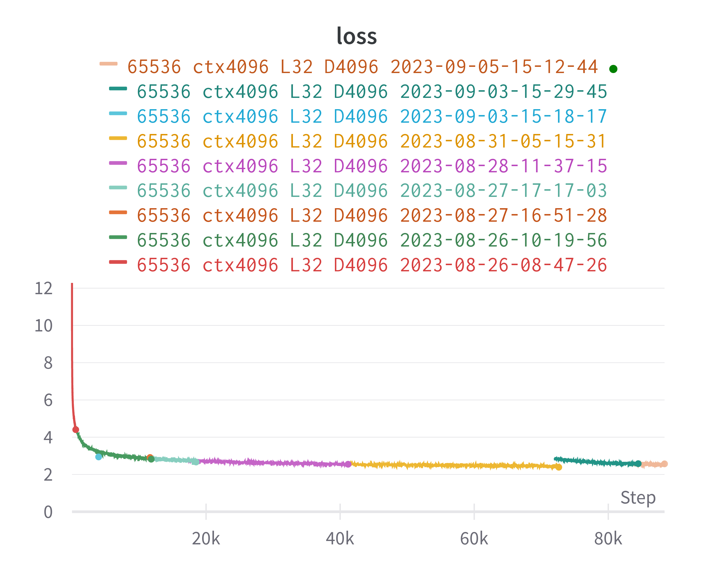

**NOTE**: This page will be updated regularly.

## Introduction
Over the past few weeks, we've been collaborating with the [RWKV](https://github.com/BlinkDL) team to pre-train a RWKV v5 model. Due to the H100s we were generously provided, we decided to aim for a 7B model.

Before we get into the details, let's discuss what RWKV even is.

### Background
Before the era of the [Transformer](https://arxiv.org/abs/1706.03762) architecture, the prevalent method for language modeling was the Recurrent Neural Network (RNNs). However, due to their inability to scale in size and attend to distant tokens in a sequence, they were often limited in capturing long-range dependencies and struggled with handling very long sequences. This limitation posed significant challenges when it came to tasks that required modeling complex relationships and context, such as MTL, summarization, and natural language understanding. Additionally, the lack of parallelization made RNNs computationally expensive to train over large datasets, making them less practical for real-world applications.

The Transformer architecture attempted to solve this issue by introducing a novel approach to sequence modeling. Instead of relying on recurrent connections, Transformers harnessed the power of self-attention mechanisms, enabling them to capture relationships between tokens regardless of their positions in the sequence. This breakthrough allowed Transformers to excel in many of the tasks RNNs failed at. The parallelizable nature of self-attention also significantly reduced the training issues.

However, Transformers introduced a fatal flaw that were not present in RNNs. They suffer from memory and computational complexity that scales quadratically with sequence length. This means that for higher context sizes in a Transformer model, the cost for inference and training rises quadratically, with a complexity of O(n^4). In contrast, RNNs exhibit linear scaling in memory, allowing theoretically infinite context lengths at negligible cost to computation. But due to the issues inherent in RNNs, they remained unusable and the Transformer reigned as the prevalent architecture for most LM tasks.

### RWKV

A couple years ago, [BlinkDL](https://github.com/BlinkDL) proposed a new architecture based on RNNs called the Receptance Weighted Key-Value (RWKV), that combines the efficient parallelizable training of Transformers with the efficient inference of RNNs.

Initial iterations of RWKV still struggled with distant tokens, but by the current version (v5), that issue has been largely addressed. Experiments suggest that RWKV performs on par with similarly sized Transformer models.

You can read the [RWKV paper](https://arxiv.org/pdf/2305.13048.pdf) for more in-depth info on the architecture.

### RWKV5 7B

RWKV v5 is still relatively new, since the training is still contained within the [RWKV-v4neo](https://github.com/BlinkDL/RWKV-LM/tree/main/RWKV-v4neo) codebase. It has, however, matured to the point where it's ready for use. In collaboration with the RWKV team, PygmalionAI has decided to pre-train a 7B RWKV5 base model. You can track the current progress in [this Weights & Biases project](https://wandb.ai/alpindale/RWKV5-7B).

The dataset we've chosen for the pre-train is Cerebras' [SlimPajama-627B](https://huggingface.co/datasets/cerebras/SlimPajama-627B). This dataset is a deduped version of [RedPajama-Data-1T](https://huggingface.co/datasets/togethercomputer/RedPajama-Data-1T), a trillion-token dataset comprised of CommonCrawl, C4, GitHub, various books, ArXiv dumps, wikipedia, and StackExchange. We believe SlimPajama offers the same (or likely better) quality at a much lower token count, due to a reduction in duplicated data.

Here's a brief overview of the model:
- **7,517,840,815** parameters
- **65536** vocab size
- **32** layers
- **4096** number of embeddings

And the current training hyperparameters:

- **2e-4** initial learning rate
- **1.47e-4** current final learning rate
- **10** warmup steps
- **0.9** AdamW beta1
- **0.99** AdamW beta2
- **1e-8** AdamW variance epsilon
- **cosine** decay
- **ZeRO 2** deepspeed stage
- **bfloat16** precision

As of writing this blog post, the model has seen 40.5 billion tokens out of 627 billion. The hardware we're using for the training is 8x NVIDIA H100 GPUs. We plan to acquire more compute to speed up the pre-train process.

The loss curve at 88,000 steps (40.5B tokens):

The sudden disconnect and spike at step ~72,000 was an interruption where we added another gate to the model and resumed training but from a slightly earlier checkpoint.

### What does this mean for Pygmalion?

Infinite context length! Sort of. Since RWKV is an RNN, we're no longer bound by the extreme memory costs of higher context length models. We plan to finetune the final base model with much higher context length, likely around 128,000 tokens. Due to the O(1) complexity, the cost of memory will be negiligible. At 16-bit precision, the memory usage will remain at roughly 15GB, and with quantization methods, that can go down to as low as 4GB for 128k context lengths.

We plan to release the base model along with a Pygmalion finetune at every every 10% of the model's training. As of writing this post, we're at 6.4%. We expect the models to improve significantly at each iteration.
